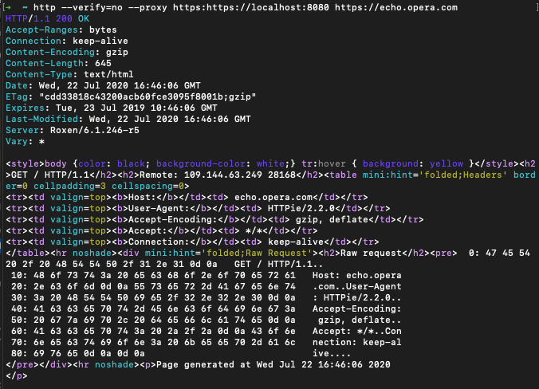
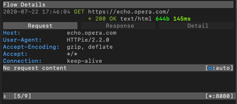
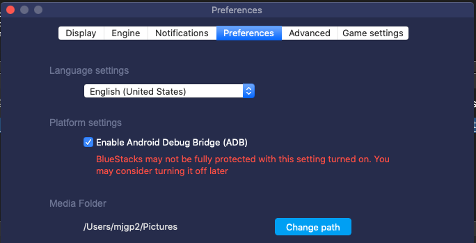
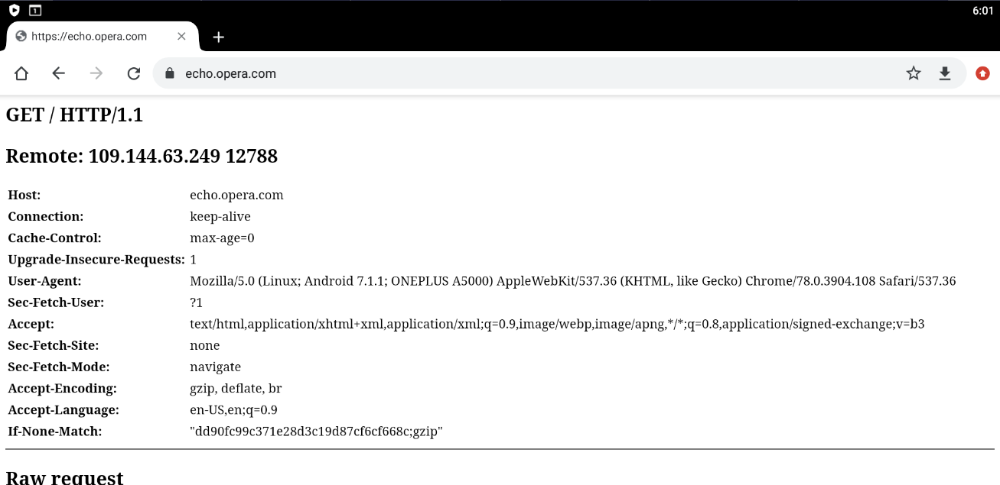
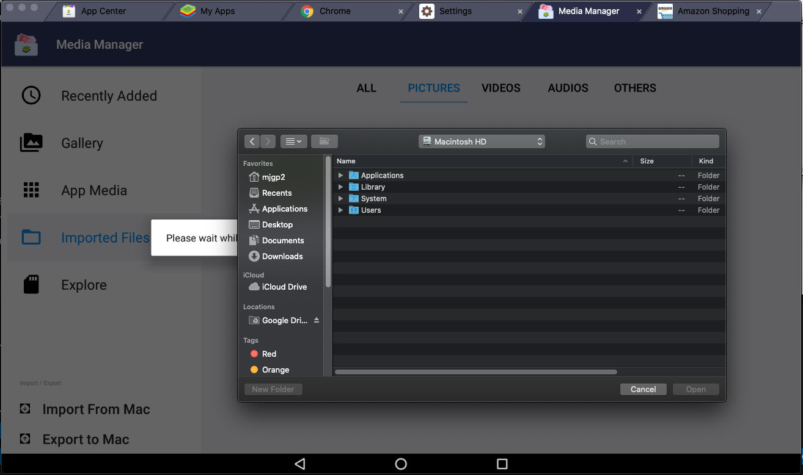
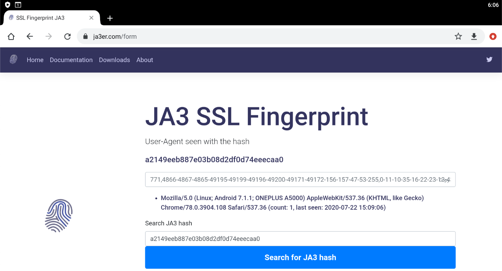

--- 
title: "Android Network Sniffing" 
date: 2020-07-22T16:55:39+01:00
draft: true

categories:
    - "android"
tags:
    - "android"
    - "hacking"
---

Recently I have become interested in being able to look at the network traffic between Android apps and the internet, to be able to fully understand what bits and bytes are flying back and forth.

To do this we are going to effectively put a man-in-the-middle proxy between the application and the server like so:

[source]
----
server <=> proxy <=> android system <=> app
----

I'm doing this on my Mac, but it would be possible on other platforms, but you would need to adjust the file paths etc.

== Proxy

I am going to use the open source https://mitmproxy.org/[mitmproxy] for the man-in-the-middle proxy. You could use others such as Charles or Fiddler, although mitmproxy has a good set of features.

Installation is as simple as `brew install mitmproxy`. Once you are installed, you can run the CLI application by executing `mitmproxy`.

You should test the proxy is working as expected:

 

You can see the request coming through the proxy:

 

== Emulator

We're not going to try using a real Android device, because in order to carry this out we are going to need root access to the device. Why? The proxy is going to need to decrypt the HTTPS traffic across it, which means generating self-signed certificates. We will need to add a new root CA certificate that the site certs use to the device certificate store, otherwise the certs will be rejected as invalid. However, we don't want to "root" the device, as there are a number of detection mechanisms that applications use to detect if your device is rooted - for example my banking app won't work on a rooted device.

So we need is an emulator. I have used https://www.bluestacks.com/[Bluestacks], which is effectively a wrapper around a VirtualBox android image that has (seemingly) been tuned for compatibility with apps (mostly games).

There's a couple of other handy things about Bluestacks - the most important being that there is a `su` executable hidden at `system/xbin/bstk/su`. 

Once you've installed and setup Bluestacks, you will see something like this:

 

Open up the settings (`⌘+,`) and enable the ADB bridge:

This enables us to use the `adb` command to get a remote shell or copy files.

=== Proxy setup

We also need to set the proxy:

[source,bash]
----
/Applications/BlueStacks.app/Contents/MacOS/confighttpproxy set 10.0.2.2 8080
----

Here `10.0.2.2` is the specific UP that is routed to the emulator host (i.e. localhost on your mac), and is the same always.

This setting only takes effect on restart of the Android VM.

=== Read-Write disks

Shutdown the emulator by exiting the application.

You now need to change the virtualbox disks to be read-write by editing `~/Library/BlueStacks/Android/Android.vbox` and updating all the types to `Normal`:

 

This will allow us to make the necessary changes to the file systems.

Start up the emulator again.

=== Adding the root CA

At this point if you try to access a secure website in Chrome on the emulator you will recieve a certificate error because it is signed by an untrusted CA.

We need to add the CA from mitmproxy to the emulator. First we need to work out what the hash is for the certificate filename, then copy it across.

[source,bash]
----
➜  cd ~/.mitmproxy
➜  HASH=$(openssl x509 -inform PEM -subject_hash_old -in mitmproxy-ca-cert.cer | head -1)
➜  cp mitmproxy-ca-cert.cer $HASH.0 
➜  alias adb=/Applications/BlueStacks.app/Contents/MacOS/adb
➜  adb connect localhost:5555
➜  adb push $HASH.0 /sdcard/Download/ 
➜  adb shell
OnePlus3T:/ $ system/xbin/bstk/su
OnePlus3T:/ # mount -o rw,remount,rw /system
OnePlus3T:/ # cp /sdcard/Download/c8750f0d.0 /system/etc/security/cacerts
OnePlus3T:/ # chmod 664 /system/etc/security/cacerts/c8750f0d.0 
----

At this point you need to restart the emulator to reload the certificates.

Go to chrome, and again try a secure site, and you should see success!

 

Check your mitmproxy log and you'll see the decrypted request.

=== SSL Certificate Pinning

You've done all this and the app still doesn't work! Drat and blast, you probably have SSL pinning to deal with.

In order to provide client-side validation that you are connecting to the correct web server (and not a mitm proxy), Android allows applications to pin SSL certificates for domains, which basically enforces that there is a specific certificate in the trust chain. This obviously is exactly what we are doing, so we need to remove this configuration.

Within the `AndroidManifest.xml` file in the root of the apk there is a property on the `application` element for network security, e.g. `android:networkSecurityConfig="@xml/network_security_config"`.

This generally is a pointer to an XML file that looks something like this:

[source,language,attributes]
----
<?xml version="1.0" encoding="utf-8"?>
<network-security-config>
    <base-config cleartextTrafficPermitted="false">
        <trust-anchors>
            <certificates src="system" />
        </trust-anchors>
    </base-config>
    <domain-config cleartextTrafficPermitted="true">
        <domain includeSubdomains="false">192.168.0.1</domain>
    </domain-config>
    <domain-config cleartextTrafficPermitted="false">
        <domain includeSubdomains="false">www.amazon.com</domain>
        <domain includeSubdomains="false">www.amazon.ca</domain>
        <domain includeSubdomains="false">www.amazon.cn</domain>
        <domain includeSubdomains="false">www.amazon.ae</domain>
        <domain includeSubdomains="false">amazon.com</domain>
        <domain includeSubdomains="false">amazon.ca</domain>
        <domain includeSubdomains="false">amazon.cn</domain>
        <domain includeSubdomains="false">amazon.ae</domain>
        <domain includeSubdomains="false">www.amazon.de</domain>
        <domain includeSubdomains="false">www.amazon.eg</domain>
        <domain includeSubdomains="false">www.amazon.es</domain>
        <domain includeSubdomains="false">www.amazon.eu</domain>
        <domain includeSubdomains="false">amazon.de</domain>
        <domain includeSubdomains="false">amazon.eg</domain>
        <domain includeSubdomains="false">amazon.es</domain>
        <domain includeSubdomains="false">amazon.eu</domain>
        <domain includeSubdomains="false">www.amazon.fr</domain>
        <domain includeSubdomains="false">www.amazon.in</domain>
        <domain includeSubdomains="false">www.amazon.it</domain>
        <domain includeSubdomains="false">www.amazon.sa</domain>
        <domain includeSubdomains="false">amazon.fr</domain>
        <domain includeSubdomains="false">amazon.in</domain>
        <domain includeSubdomains="false">amazon.it</domain>
        <domain includeSubdomains="false">amazon.sa</domain>
        <domain includeSubdomains="false">www.amazon.sg</domain>
        <domain includeSubdomains="false">www.amazon.co.jp</domain>
        <domain includeSubdomains="false">www.amazon.co.uk</domain>
        <domain includeSubdomains="false">www.amazon.com.au</domain>
        <domain includeSubdomains="false">amazon.sg</domain>
        <domain includeSubdomains="false">amazon.co.jp</domain>
        <domain includeSubdomains="false">amazon.co.uk</domain>
        <domain includeSubdomains="false">amazon.com.au</domain>
        <domain includeSubdomains="false">www.amazon.com.br</domain>
        <domain includeSubdomains="false">www.amazon.com.mx</domain>
        <domain includeSubdomains="false">www.amazon.com.sg</domain>
        <domain includeSubdomains="false">www.amazon.com.tr</domain>
        <domain includeSubdomains="false">amazon.com.br</domain>
        <domain includeSubdomains="false">amazon.com.mx</domain>
        <domain includeSubdomains="false">amazon.com.sg</domain>
        <domain includeSubdomains="false">amazon.com.tr</domain>
        <pin-set expiration="2021-01-01">
            <pin digest="SHA-256">i7WTqTvh0OioIruIfFR4kMPnBqrS2rdiVPl/s2uC/CY=</pin>
            <pin digest="SHA-256">njN4rRG+22dNXAi+yb8e3UMypgzPUPHlv4+foULwl1g=</pin>
            <pin digest="SHA-256">++MBgDH5WGvL9Bcn5Be30cRcL0f5O+NyoXuWtQdX1aI=</pin>
            <pin digest="SHA-256">f0KW/FtqTjs108NpYj42SrGvOB2PpxIVM8nWxjPqJGE=</pin>
            <pin digest="SHA-256">NqvDJlas/GRcYbcWE8S/IceH9cq77kg0jVhZeAPXq8k=</pin>
            <pin digest="SHA-256">9+ze1cZgR9KO1kZrVDxA4HQ6voHRCSVNz4RdTCx4U8U=</pin>
            <pin digest="SHA-256">KwccWaCgrnaw6tsrrSO61FgLacNgG2MMLq8GE6+oP5I=</pin>
            <pin digest="SHA-256">Ko8tivDrEjiY90yGasP6ZpBU4jwXvHqVvQI0GS3GNdA=</pin>
            <pin digest="SHA-256">k8Uip80eqbtdRbXBDlElIB3v2Ru9YTmO78oAYHuq+dI=</pin>
            <pin digest="SHA-256">JbQbUG5JMJUoI6brnx0x3vZF6jilxsapbXGVfjhN8Fg=</pin>
        </pin-set>
    </domain-config>
</network-security-config>
----

What we need to do is to replace this configuration with a blank configuration.

Firstly you need to extract the apk from the emulator that you've installed; you can pull all apks from the emulator like this:

[source,bash]
----
for i in $(adb shell pm list packages | awk -F':' '{print $2}'); do adb pull "$(adb shell pm path $i | awk -F':' '{print $2}')"; mv base.apk $i.apk 2&> /dev/null ;done
----

You can decompile this with https://ibotpeaches.github.io/Apktool/[apktool], for example:

`apktool d com.amazon.mShop.android.shopping.apk`

This tool will dump out the app. (I have not had 100% success using it to rebuild applications.)

Now you can check the `AndroidManifest.xml` file in the root of the dumped apk to see where the `networkSecurityConfig` is pointing to so we can replace it. `@xml/network_security_config` will get mapped to `res/xml/network_security_config.xml`. However, this is not a text XML, as Android uses a custom binary XML format.

We are going to replace security config and re-sign the application. 

First up create a text XML empty config.

.network_security_config.plain.xml
[source,xml,attributes]
----
<?xml version="1.0" encoding="utf-8"?>
<network-security-config>
</network-security-config>
----

Now you can encode it using https://github.com/hzw1199/xml2axml[xml2axml] and replace it in the apk:

[source,bash,attributes]
----
java -jar xml2axml-1.1.0-SNAPSHOT.jar e network_security_config.plain.xml res/xml/network_security_config.xml
alias aapt=/Applications/BlueStacks.app/Contents/MacOS/aapt
aapt remove -v my.apk res/xml/network_security_config.xml
aapt add -v my.apk res/xml/network_security_config.xml
----

Now we need to sign. Create a open ssl config file:

.openssl.cnf
[source,language,attributes]
----
[ req ]
default_bits        = 2048
default_keyfile     = ca.key
default_md          = sha256
default_days        = 825
encrypt_key         = no
distinguished_name  = subject
req_extensions      = req_ext
x509_extensions     = x509_ext
string_mask         = utf8only
prompt              = no

# The Subject DN can be formed using X501 or RFC 4514 (see RFC 4519 for a description).
#   Its sort of a mashup. For example, RFC 4514 does not provide emailAddress.

[ subject ]
countryName                 = US
stateOrProvinceName         = Oklahoma
localityName                = Stillwater
organizationName            = My Company
OU                          = Engineering

# Use a friendly name here because it's presented to the user. The server's DNS
#   names are placed in Subject Alternate Names. Plus, DNS names here is deprecated
#   by both IETF and CA/Browser Forums. If you place a DNS name here, then you
#   must include the DNS name in the SAN too (otherwise, Chrome and others that
#   strictly follow the CA/Browser Baseline Requirements will fail).

commonName              = test.com
emailAddress            = me@home.com

# Section x509_ext is used when generating a self-signed certificate. I.e., openssl req -x509 ...

[ x509_ext ]
subjectKeyIdentifier      = hash
authorityKeyIdentifier    = keyid:always,issuer

# You only need digitalSignature below. *If* you don't allow
#   RSA Key transport (i.e., you use ephemeral cipher suites), then
#   omit keyEncipherment because that's key transport.

basicConstraints        = critical, CA:TRUE
keyUsage            = critical, digitalSignature, keyEncipherment, cRLSign, keyCertSign
subjectAltName          = DNS:test.com
extendedKeyUsage = serverAuth

# RFC 5280, Section 4.2.1.12 makes EKU optional
#   CA/Browser Baseline Requirements, Appendix (B)(3)(G) makes me confused
#   In either case, you probably only need serverAuth.

extendedKeyUsage    = TLS Web Server Authentication

# Section req_ext is used when generating a certificate signing request. I.e., openssl req ...

[ req_ext ]
subjectKeyIdentifier        = hash
basicConstraints        = CA:FALSE
keyUsage            = digitalSignature, keyEncipherment
subjectAltName          = DNS:test.com
nsComment           = "OpenSSL Generated Certificate"

# RFC 5280, Section 4.2.1.12 makes EKU optional
#   CA/Browser Baseline Requirements, Appendix (B)(3)(G) makes me confused
#   In either case, you probably only need serverAuth.
# extendedKeyUsage    = serverAuth, clientAuth

# [ alternate_names ]
# DNS.1       = example.com
# DNS.2       = www.example.com
# DNS.3       = mail.example.com
# DNS.4       = ftp.example.com

# Add these if you need them. But usually you don't want them or
#   need them in production. You may need them for development.
# DNS.5       = localhost
# DNS.6       = localhost.localdomain
# DNS.7       = 127.0.0.1

# IPv6 localhost
# DNS.8     = ::1

----

Now we can sign the app:

[source,bash,attributes]
----
openssl req -config openssl.cnf -new -x509 -days 825 -out ca.crt
openssl pkcs8 -topk8 -in ca.key -out key.pkcs8 -outform DER -nocrypt
~/Library/Android/sdk/build-tools/30.0.1/zipalign 4 modified.apk modified-zipaligned.apk
~/Library/Android/sdk/build-tools/30.0.1/apksigner sign --key key.pkcs8 --cert ca.crt --out modified-signed.apk modified-zipaligned.apk
----

Once this is done you can uninstall from the app, transfer the new apk across using the Media Manager on Bluestacks, and then just tap to install the apk:

 

=== SSL Fingerprint sniffing

It is possible unfortunately to be able to tell that the requests are going through the mitm proxy because the SSL fingerprint is different:

It's a future piece of work to incorporate SSL fingerprint spoofing into the proxy solution.